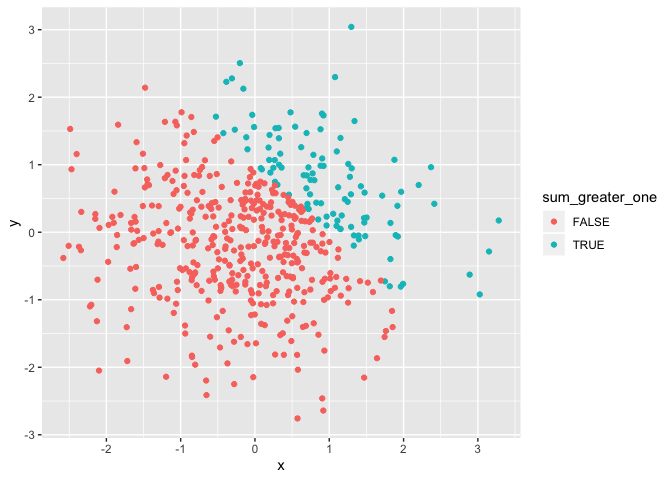
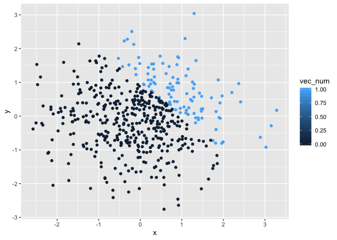
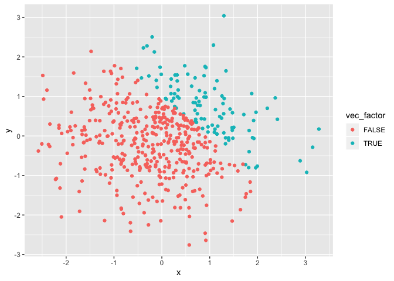

P8105\_hw1\_md3851
================
Misbath Daouda
9/13/2019

Problem 1
---------

### Part 1: Creating a table

This chunck of code creates a table following the guidelines for problem 1.

``` r
example_df = tibble(
  norm_samp = rnorm(8),
  norm_samp_pos = norm_samp > 0,
  vec_char = c("This", "is", "an", "assignment", "for", "data", "science", "class"),
  vec_factor = factor(c("small", "medium", "large", "small", "medium", "large", "small", "small"))
)
example_df
```

    ## # A tibble: 8 x 4
    ##   norm_samp norm_samp_pos vec_char   vec_factor
    ##       <dbl> <lgl>         <chr>      <fct>     
    ## 1    -0.423 FALSE         This       small     
    ## 2    -0.343 FALSE         is         medium    
    ## 3    -0.191 FALSE         an         large     
    ## 4    -0.517 FALSE         assignment small     
    ## 5    -1.82  FALSE         for        medium    
    ## 6    -0.792 FALSE         data       large     
    ## 7     0.698 TRUE          science    small     
    ## 8     1.32  TRUE          class      small

### Part 2: Understanding the nature of variables

This chunck of code attempts to calculate the respective means of the variables included in the table from Part 1

``` r
mean(pull(example_df, var=norm_samp))
```

    ## [1] -0.2587232

``` r
mean(pull(example_df, var=norm_samp_pos))
```

    ## [1] 0.25

``` r
mean(pull(example_df, var=vec_char))
```

    ## [1] NA

``` r
mean(pull(example_df, var=vec_factor))
```

    ## [1] NA

R returns error messages along with the value "NA" for the character and factor variables (ie, vec\_char and vec\_factor). The mean can only be calculated for numeric and logical variables (ie, norm\_samp and norm\_samp\_pos).

### Part 3: Converting variables

``` r
as.numeric(pull(example_df, var=norm_samp_pos))
as.numeric(pull(example_df, var=vec_char))
as.numeric(pull(example_df, var=vec_factor))
```

The "as.numeric" function succesfully transforms the logical variable using a binary system to represent the TRUE/FALSE options. FALSE is converted to 0 and TRUE to 1. This explains what happened when taking the mean: R treated this logical variable as a numeric variable made up of two values (0 and 1). This is why the mean (0.25) falls between 0 and 1.

The "as.numeric" function also succesfully assigns integers (ie, 1, 2, 3) to the three levels (ie, large, medium, small) of the factor variable.

However, the character variable cannot be converted to a numeric one.

``` r
pull(
  example_df, var=norm_samp) * as.numeric(
  pull(example_df, var=norm_samp_pos)
  )
```

    ## [1] 0.0000000 0.0000000 0.0000000 0.0000000 0.0000000 0.0000000 0.6981436
    ## [8] 1.3175021

``` r
pull(
  example_df, var=norm_samp) * as.factor(
  pull(example_df, var=norm_samp_pos)
  )
```

    ## Warning in Ops.factor(pull(example_df, var = norm_samp),
    ## as.factor(pull(example_df, : '*' not meaningful for factors

    ## [1] NA NA NA NA NA NA NA NA

``` r
pull(
  example_df, var=norm_samp) * as.numeric(
  as.factor(pull(example_df, var=norm_samp_pos))
  ) 
```

    ## [1] -0.4234142 -0.3429595 -0.1909898 -0.5171927 -1.8191871 -0.7916877
    ## [7]  1.3962872  2.6350042

Problem 2
---------

This chunck of code creates a table following the guidelines for problem 2.

``` r
example2_df = tibble(
  x = rnorm(500),
  y = rnorm(500),
  sum_greater_one = x + y > 1,
  vec_num = as.numeric(sum_greater_one),
  vec_factor = as.factor(sum_greater_one)
)

example2_df
```

    ## # A tibble: 500 x 5
    ##         x        y sum_greater_one vec_num vec_factor
    ##     <dbl>    <dbl> <lgl>             <dbl> <fct>     
    ##  1  1.16  -0.940   FALSE                 0 FALSE     
    ##  2  1.08  -0.824   FALSE                 0 FALSE     
    ##  3 -0.828 -0.448   FALSE                 0 FALSE     
    ##  4  1.25   0.450   TRUE                  1 TRUE      
    ##  5 -0.141  0.338   FALSE                 0 FALSE     
    ##  6 -1.14  -0.00959 FALSE                 0 FALSE     
    ##  7  1.40  -0.106   TRUE                  1 TRUE      
    ##  8  0.701  0.369   TRUE                  1 TRUE      
    ##  9  1.09  -0.662   FALSE                 0 FALSE     
    ## 10 -1.37  -0.855   FALSE                 0 FALSE     
    ## # … with 490 more rows

This data frame contains 5 variables and 500 observations. The mean and median of the sample are -0.0224846 and 0.0229567 respectively. Its standard deviation is 1.0139211.

The proportion of the sample such that x + y &gt; 1 is 0.206.

``` r
plot1 = ggplot(example2_df, aes(x = x, y = y, color = sum_greater_one)) + geom_point()
plot1
```



``` r
plot2 = ggplot(example2_df, aes(x = x, y = y, color = vec_num)) + geom_point()
plot2
```



``` r
plot3 = ggplot(example2_df, aes(x = x, y = y, color = vec_factor)) + geom_point()
plot3
```



``` r
ggsave("homework1.pdf", plot=plot1)
```

    ## Saving 7 x 5 in image

The color scale is binary for the first and third plots since the variables used for color coding are dichotomous. However, the third plot is color coded based on a continuous variable so the scale is a gradient between 0 and 1 as R assumes that the variable could take on any value between these two integers.
