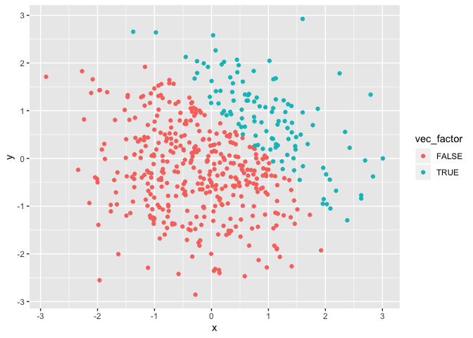

P8105\_hw1\_md3851
================
Misbath Daouda
9/13/2019

Problem 1
---------

### Part 1: Creating a table

This chunck of code creates a table following the guidelines for homework 1

    ## ── Attaching packages ──────────────────────────────────────────── tidyverse 1.2.1 ──

    ## ✔ ggplot2 3.2.0     ✔ purrr   0.3.2
    ## ✔ tibble  2.1.3     ✔ dplyr   0.8.3
    ## ✔ tidyr   0.8.3     ✔ stringr 1.4.0
    ## ✔ readr   1.3.1     ✔ forcats 0.4.0

    ## ── Conflicts ─────────────────────────────────────────────── tidyverse_conflicts() ──
    ## ✖ dplyr::filter() masks stats::filter()
    ## ✖ dplyr::lag()    masks stats::lag()

    ## # A tibble: 8 x 4
    ##   norm_samp norm_samp_pos vec_char   vec_factor
    ##       <dbl> <lgl>         <chr>      <fct>     
    ## 1    2.47   TRUE          This       small     
    ## 2    1.83   TRUE          is         medium    
    ## 3   -0.253  FALSE         an         large     
    ## 4    0.404  TRUE          assignment small     
    ## 5   -0.0550 FALSE         for        medium    
    ## 6    0.288  TRUE          data       large     
    ## 7    0.241  TRUE          science    small     
    ## 8   -1.22   FALSE         class      small

### Part 2: Understanding the nature of variables

This chunck of code attempts to calculate the respective means of the variables included in the table from Part 1

``` r
mean(pull(example_df, var=norm_samp))
```

    ## [1] 0.4631898

``` r
mean(pull(example_df, var=norm_samp_pos))
```

    ## [1] 0.625

``` r
mean(pull(example_df, var=vec_char))
```

    ## Warning in mean.default(pull(example_df, var = vec_char)): argument is not
    ## numeric or logical: returning NA

    ## [1] NA

``` r
mean(pull(example_df, var=vec_factor))
```

    ## Warning in mean.default(pull(example_df, var = vec_factor)): argument is
    ## not numeric or logical: returning NA

    ## [1] NA

This shows that the mean can only be calculated for numeric and logical variables (ie, norm\_samp and norm\_samp\_pos)

### Part 3: Converting variables

``` r
pull(
  example_df, var=norm_samp) * as.numeric(
  pull(example_df, var=norm_samp_pos)
  )
```

    ## [1] 2.4722515 1.8298863 0.0000000 0.4035944 0.0000000 0.2875793 0.2405551
    ## [8] 0.0000000

``` r
pull(
  example_df, var=norm_samp) * as.factor(
  pull(example_df, var=norm_samp_pos)
  )
```

    ## Warning in Ops.factor(pull(example_df, var = norm_samp),
    ## as.factor(pull(example_df, : '*' not meaningful for factors

    ## [1] NA NA NA NA NA NA NA NA

``` r
pull(
  example_df, var=norm_samp) * as.numeric(
  as.factor(pull(example_df, var=norm_samp_pos))
  ) 
```

    ## [1]  4.94450306  3.65977264 -0.25256110  0.80718874 -0.05503411  0.57515853
    ## [7]  0.48111030 -1.22075290

Problem 2
---------

``` r
library(tidyverse)
example2_df = tibble(
  x = rnorm(500),
  y = rnorm(500),
  sum_greater_one = x + y > 1,
  vec_num = as.numeric(sum_greater_one),
  vec_factor = as.factor(sum_greater_one)
)

example2_df
```

    ## # A tibble: 500 x 5
    ##          x       y sum_greater_one vec_num vec_factor
    ##      <dbl>   <dbl> <lgl>             <dbl> <fct>     
    ##  1 -0.713   0.779  FALSE                 0 FALSE     
    ##  2  1.20    1.06   TRUE                  1 TRUE      
    ##  3 -0.419  -0.140  FALSE                 0 FALSE     
    ##  4 -1.36    0.971  FALSE                 0 FALSE     
    ##  5 -0.617  -0.384  FALSE                 0 FALSE     
    ##  6  0.320  -0.968  FALSE                 0 FALSE     
    ##  7 -1.00    0.448  FALSE                 0 FALSE     
    ##  8 -1.23    1.37   FALSE                 0 FALSE     
    ##  9  0.594   0.353  FALSE                 0 FALSE     
    ## 10  0.0547  0.0486 FALSE                 0 FALSE     
    ## # … with 490 more rows

This data frame contains 5 variables and 500 rows.

The mean of the sample is 0.0216701.

The median of the sample is 0.0485538.

The standard deviation of the sample is 0.9916832.

The proportion of the sample such that x+y &gt; 1 is ...

``` r
ggplot(example2_df, aes(x = x, y = y, color = sum_greater_one)) + geom_point()
```


``` r
ggplot(example2_df, aes(x = x, y = y, color = vec_num)) + geom_point()
```


``` r
ggplot(example2_df, aes(x = x, y = y, color = vec_factor)) + geom_point()
```


